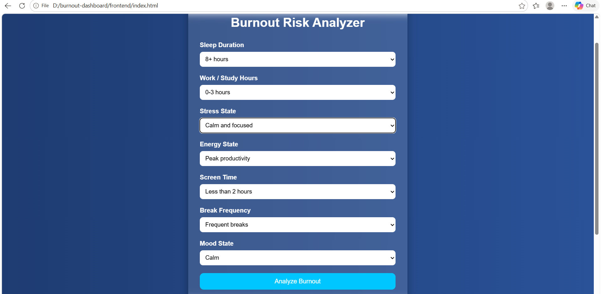
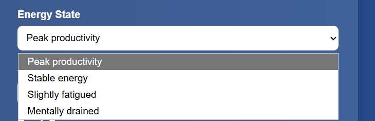
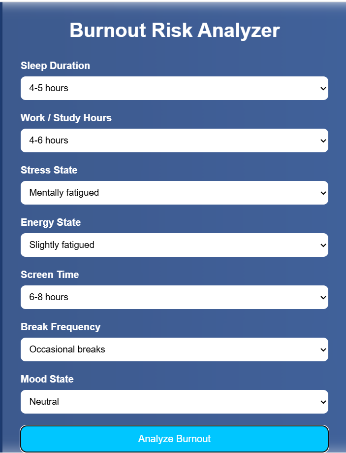
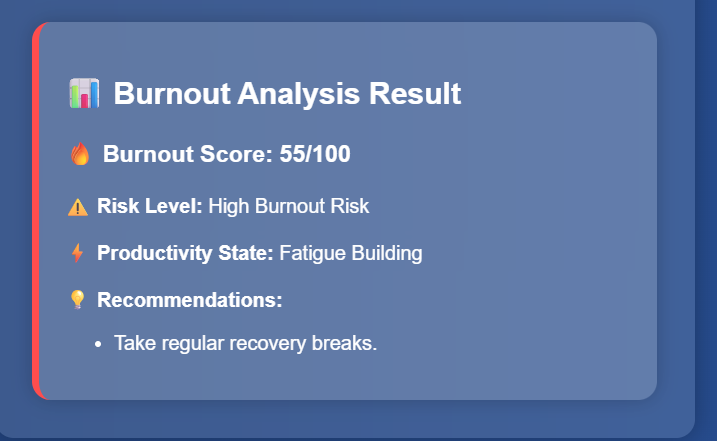
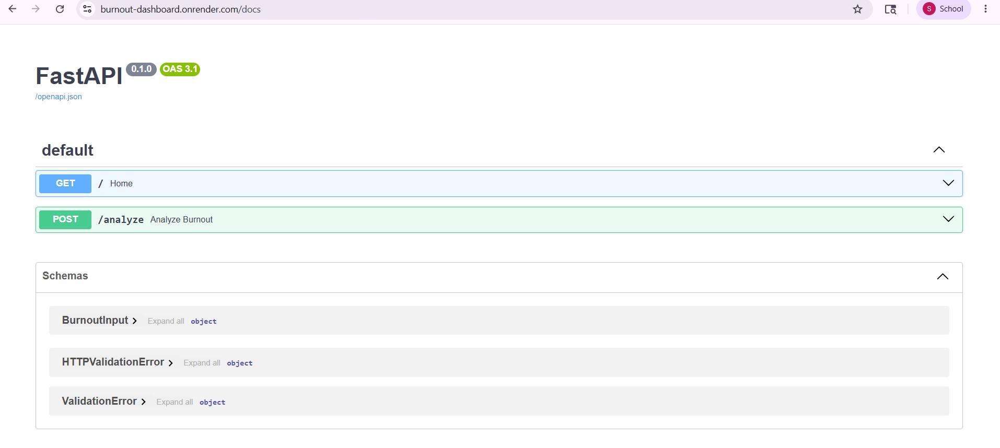
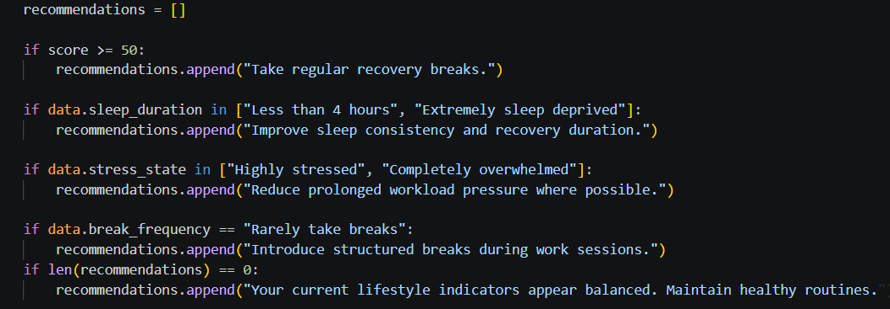

# Burnout Risk Analyzer

## Project Overview

The Burnout Risk Analyzer is a full-stack web application designed to estimate a user's burnout risk using daily lifestyle and productivity-related habits.

The aim of the project is to help users identify unhealthy work/study patterns and provide simple recommendations that may help improve balance, recovery, and productivity.

The application takes multiple lifestyle-related inputs through dropdown selections and generates:

- Burnout Score
- Risk Level
- Productivity State
- Personalized Recommendations

The project uses:
- FastAPI (Python) for backend logic
- HTML, CSS and JavaScript for frontend interaction
- Render for backend deployment
- Vercel for frontend deployment

---

# Input Parameters

The application uses dropdown-based input fields to keep the UI simple and beginner-friendly.

The following parameters are used:

| Parameter | Purpose |
|---|---|
| Sleep Duration | Measures recovery and rest quality |
| Work/Study Hours | Measures workload intensity |
| Stress State | Measures mental pressure/stress |
| Energy State | Measures fatigue and tiredness |
| Screen Time | Measures digital workload exposure |
| Break Frequency | Measures recovery during work/study |
| Mood State | Measures emotional exhaustion |

Each dropdown option contributes a predefined score.

Healthy lifestyle choices contribute lower scores, while stressful or unhealthy choices contribute higher scores.

The final burnout score is calculated out of 100.

---

# Point-Based Burnout Scoring System

## 1. Sleep Duration (Maximum: 20 Points)

| Option | Score |
|---|---|
| 8+ hours | 0 |
| 6–8 hours | 10 |
| 4–6 hours | 15 |
| Less than 4 hours | 20 |
| Extremely sleep deprived | 20 |

---

## 2. Work/Study Hours (Maximum: 15 Points)

| Option | Score |
|---|---|
| 0–3 hours | 0 |
| 4–6 hours | 5 |
| 7–9 hours | 10 |
| 10+ hours | 15 |

---

## 3. Stress State (Maximum: 20 Points)

| Option | Score |
|---|---|
| Calm and focused | 0 |
| Slightly stressed | 10 |
| Highly stressed | 15 |
| Completely overwhelmed | 20 |

---

## 4. Energy State (Maximum: 15 Points)

| Option | Score |
|---|---|
| Peak productivity | 0 |
| Slightly tired | 5 |
| Mentally exhausted | 10 |
| Burned out | 15 |

---

## 5. Screen Time (Maximum: 5 Points)

| Option | Score |
|---|---|
| Less than 2 hours | 0 |
| 2–5 hours | 2 |
| 5–8 hours | 4 |
| 8+ hours | 5 |

---

## 6. Break Frequency (Maximum: 15 Points)

| Option | Score |
|---|---|
| Frequent breaks | 0 |
| Sometimes take breaks | 5 |
| Rarely take breaks | 15 |

---

## 7. Mood State (Maximum: 10 Points)

| Option | Score |
|---|---|
| Calm | 0 |
| Slightly drained | 5 |
| Emotionally exhausted | 10 |

---

# Example Burnout Score Calculation

| Parameter | Selected Input | Score |
|---|---|---|
| Sleep Duration | 4–6 hours | 15 |
| Work Hours | 10+ hours | 15 |
| Stress State | Highly stressed | 15 |
| Energy State | Mentally exhausted | 10 |
| Screen Time | 5–8 hours | 4 |
| Break Frequency | Sometimes take breaks | 5 |
| Mood State | Slightly drained | 5 |

### Total Burnout Score

15 + 15 + 15 + 10 + 4 + 5 + 5 = 69

Final Burnout Score = 69/100

---

# Burnout Risk Classification

| Burnout Score | Risk Level |
|---|---|
| 0–25 | Low Burnout Risk |
| 26–50 | Moderate Burnout Risk |
| 51–75 | High Burnout Risk |
| 76–100 | Critical Burnout Risk |

Higher scores indicate higher burnout risk.

---

# Productivity State Logic

The productivity state is generated using the burnout score range.

| Burnout Score Range | Productivity State |
|---|---|
| 0–25 | Peak Performance |
| 26–50 | Stable but Fatigued |
| 51–75 | Fatigue Building |
| 76–100 | Recovery Needed |

As burnout increases, the productivity state becomes more negative.

---

# Recommendation Generation Logic

The recommendation system is condition-based.

The backend checks whether certain high-risk conditions are selected by the user and then generates recommendations accordingly.

The recommendations are not randomly generated.  
Each recommendation depends on specific user inputs.

---

## Recommendation Conditions

### 1. High Burnout Score

If:

```plaintext
Burnout Score >= 50
```

Recommendation generated:

```plaintext
Take regular recovery breaks.
```

This recommendation appears when the user's overall burnout level becomes high.

---

### 2. Very Low Sleep Duration

If the user selects:

- Less than 4 hours
- Extremely sleep deprived

Recommendation generated:

```plaintext
Improve sleep consistency and recovery duration.
```

This recommendation focuses on improving recovery and rest quality.

---

### 3. Very High Stress Levels

If the user selects:

- Highly stressed
- Completely overwhelmed

Recommendation generated:

```plaintext
Reduce prolonged workload pressure where possible.
```

This recommendation appears when mental pressure becomes excessive.

---

### 4. Rarely Taking Breaks

If the user selects:

- Rarely take breaks

Recommendation generated:

```plaintext
Introduce structured breaks during work sessions.
```

This recommendation encourages recovery during long work/study sessions.

---

## Balanced Lifestyle Case

If none of the burnout-related conditions are triggered, the system displays:

```plaintext
Your current lifestyle indicators appear balanced. Maintain healthy routines.
```

This acts as a positive maintenance recommendation for users with healthier lifestyle patterns.

---

# Tech Stack

## Tools used for developing Frontend:
- HTML
- CSS
- JavaScript

##  Tools used for developing Backend:
- FastAPI (Python)

## Deployment
- Vercel(For frontend)
- Render(For backend)

---

# Live Project

## Frontend URL:
https://burnout-dashboard-mu.vercel.app/


## Backend API
https://burnout-dashboard.onrender.com

---

# GitHub Repository

https://github.com/Swanand-Samant06/burnout-dashboard

---

# Running Locally

## Backend Setup

```bash
cd backend
pip install -r requirements.txt
uvicorn main:app --reload
```

## Frontend Setup

Open:

```plaintext
frontend/index.html
```

in browser.

---

# Screenshots


Dropdown options for input:







Fast API documentation:



logic behind how recommendations are generated:




---

# Developed by: Swanand Samant


